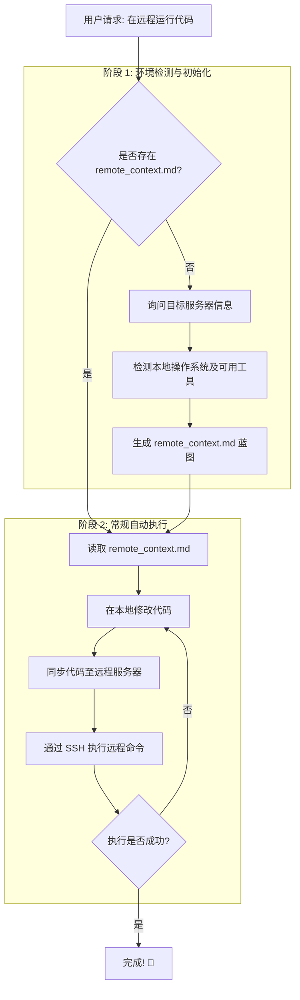

# 🤖 AI Agent Skill: AntiGravity Remote Sync (远程无缝执行) 🚀

[🇨🇳 中文](README.md) | [🇬🇧 English](README_en.md)

> 专为大语言模型 Agent (如 AntiGravity) 设计的跨平台远程同步与执行技能。在本地无感开发，由 Agent 自动推送到远端服务器进行测试与执行。

## 🌟 简介

**一句话总结：让 AI Agent 在本地写代码，然后自动一键同步并运行到远端服务器。**

无论你使用 Windows、WSL 还是 Mac 开发，这个技能都会自动帮你搞定环境检测、连接配置（生成 `remote_context.md` ），并搞定代码的远端投递执行。你只需在本地专心指挥，重度运算和部署都交给远端。

---

## ⚠️ 本地为主架构与空目录自动拉取 (Auto-Pull)

本工作流日常遵循 **“本地修改 $\rightarrow$ 推送远端”** 的机制。但如果你刚开始这个项目，且本地目录是空的，**Agent 可以自动帮你从远端服务器拉取已有的项目代码！**

**那我服务器上几个 G 的数据集和模型权重也会被拉下来吗？**
**绝对不会！** Agent 在拉取前，会先登录服务器查看一级目录的大小，并自动帮你排除掉毫无必要的超大文件夹（比如 `dataset/`, `models/`, 权重文件等），只把轻量的核心代码接回本地。
此外，当你后续向远端同步代码时，Agent 也会配置忽略规则，**绝不会覆盖、删除或影响到远端服务器原本存放的大模型文件。**

---

## 🛠️ 主要特性

- **全平台盲切**：无论你是没配环境变量的纯 Windows、WSL、还是 Macbook，Agent 会根据环境自动决定运行策略。
- **智能降级同步机制**：有 Git / rsync 就增量同步；遇到什么都没装的原生 Windows，就自动切成原生 OpenSSH `scp` 强行投递。
- **一次配置，终身无感**：生成 `remote_context.md` 后，后续再开新的对话让 Agent 跑代码，你都不必重复回答远端服务器 IP 和密码。
- **不仅仅是 GPU**：从最初只支持显卡训练的任务脱胎换骨，如今无论你在远端挂 Node.js 写前后端，还是配置 Django 都可以完美支持。

---

## 🔄 执行流程图

以下是该技能工作流如何无缝处理远程执行请求的完整流程：

---

## 🚀 如何使用

只需呼叫你的专属 AI 助手：
> _“这项目我想在远程运行，帮我运行一下 AntiGravity 远程同步执行技能”_

Agent 就会自动从询问服务器信息开始，帮你铺垫好通往服务器的高速公路！
