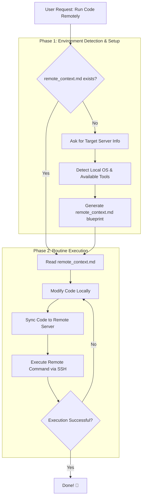

# AntiGravity Remote Sync 🚀

[🇨🇳 中文](README_zh.md) | [🇬🇧 English](README.md)

> A powerful, cross-platform AI Agent skill that effortlessly bridges your local development environment with remote Linux servers. Write code locally, and let **AntiGravity** automatically sync and execute it on the server.

## 🌟 Introduction

**TL;DR: Let your AI Agent write code locally, then automatically sync and execute it on your remote server in one click.**

Whether you are on Windows, WSL, or Mac, this skill handles environment detection, connection setup (via `remote_context.md`), and code delivery for you. Focus on guiding the agent locally while running heavy computations or deployments remotely.

---

## ⚠️ READ BEFORE USE: Local First Architecture

This workflow operates strictly on a **Local $\rightarrow$ Remote** sync paradigm. **It DOES NOT support syncing files from the Remote server back to Local.**

If you have an existing project on a remote server, **you MUST mutually pull the core code files to your local machine first.** 

**Wait, what about huge files (Datasets, Models, Checkpoints)?**
You **DO NOT** need to download massive files (like large datasets, huge models, or heavy database files) to your local machine. You only need to copy the core logic files. The Agent is smart enough to SSH into your remote directory, examine the file structure (like spotting a `datasets/` folder on the server), and adapt its paths accordingly when writing the code. *(If you are developing a project completely from scratch locally, you can ignore all of this!)*

*(Note: To prevent context overflow, the Agent will only perform a shallow exploration of the first-level directory structure using commands like `ls` rather than full recursive `tree` commands. It only needs to know that a `data/` folder exists, not every single file inside it.)*

---

## 🛠️ Features

- **Universal OS Detection**: Auto-detects pure Windows CMD/PowerShell, WSL, or Linux natively.
- **Smart Fallback Sync**: Uses `rsync` recursively where available (Linux/WSL/GitBash), but gracefully downgrades to standard OpenSSH `scp` on strict Windows configurations.
- **Context Generation**: Automatically drops a `remote_context.md` to hold session commands. **Say goodbye to typing your password 50 times in one dev session!**
- **Hardware Agnostic**: No longer tied specifically to GPUs. Works beautifully for simple Web servers (Nginx/NodeJS/Django) just as well as heavy Deep Learning pipelines.

---

## 🔄 Execution Flow

Here is how the skill workflow handles your remote execution requests seamlessly:

---

## 🚀 How to Use

Tell your AI Agent (e.g. AntiGravity):
> _"Please configure the remote server execution for me. Use the AntiGravity Remote Sync skill."_

The Agent will guide you through the process, prompting for necessary details, and initialize the environment!
