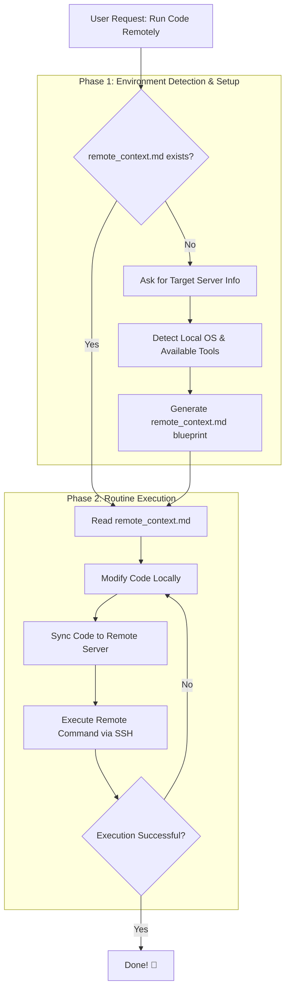

# 🤖 AI Agent Skill: AntiGravity Remote Sync 🚀

[🇨🇳 中文](README.md) | [🇬🇧 English](README_en.md)

> A powerful, cross-platform AI Agent skill that effortlessly bridges your local development environment with remote Linux servers. Write code locally, and let **AntiGravity** automatically sync and execute it on the server.

## 🌟 Introduction

**TL;DR: Let your AI Agent write code locally, then automatically sync and execute it on your remote server in one click.**

Whether you are on Windows, WSL, or Mac, this skill handles environment detection, connection setup (via `remote_context.md`), and code delivery for you. Focus on guiding the agent locally while running heavy computations or deployments remotely.

---

## ⚠️ Local First Architecture & Auto-Pull

This workflow primarily operates on a **Local $\rightarrow$ Remote** sync paradigm. However, if you are just starting and your local directory is practically empty, **the Agent can automatically pull your existing project from the remote server for you.**

**What about huge files (Datasets, Models, Checkpoints)?**
The Agent will automatically check your remote folder sizes before pulling. It will suggest excluding massive folders (like `dataset/`, model weights, heavy database files) from being downloaded. You only pull the core codebase! 
Furthermore, when the Agent syncs your updated code *back* to the server, it will be configured with ignore rules, ensuring your remote model weights are perfectly safe and entirely untouched.

---

## 🛠️ Features

- **Universal OS Detection**: Auto-detects pure Windows CMD/PowerShell, WSL, or Linux natively.
- **Smart Fallback Sync**: Uses `rsync` recursively where available (Linux/WSL/GitBash), but gracefully downgrades to standard OpenSSH `scp` on strict Windows configurations.
- **Context Generation**: Automatically drops a `remote_context.md` to hold session commands. **Say goodbye to typing your password 50 times in one dev session!**
- **Hardware Agnostic**: No longer tied specifically to GPUs. Works beautifully for simple Web servers (Nginx/NodeJS/Django) just as well as heavy Deep Learning pipelines.

---

## 🔄 Execution Flow

Here is how the skill workflow handles your remote execution requests seamlessly:

---

## 🚀 How to Use

Tell your AI Agent (e.g. AntiGravity):
> _"Please configure the remote server execution for me. Use the AntiGravity Remote Sync skill."_

The Agent will guide you through the process, prompting for necessary details, and initialize the environment!
