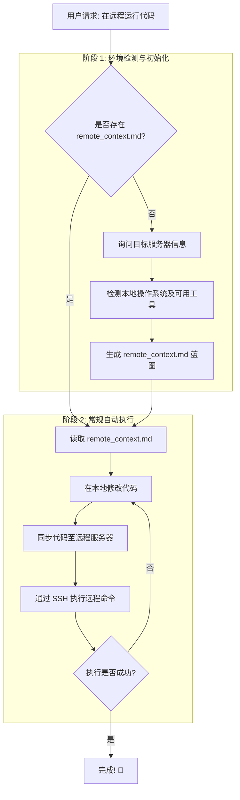

# AntiGravity Remote Sync (远程无缝执行技能) 🚀

[🇨🇳 中文](README_zh.md) | [🇬🇧 English](README.md)

> 专为大语言模型 Agent (如 AntiGravity) 设计的跨平台远程同步与执行技能。在本地无感开发，由 Agent 自动推送到远端服务器进行测试与执行。

## 🌟 简介

当你开发包含网站后端、机器学习等复杂项目时，我们常常面临一个问题：**本地有最好的代码编辑环境，但程序的最终运行却必须依赖远程服务器**（比如需要GPU、特定的网络架构或原生的Linux运行环境）。

这个项目正是为你和你的 AI Agent 准备的通用化自动化工具箱。它能让 Agent：
1. 自动探测你本地系统到底是纯净的 Windows，还是附带了工具链的 WSL / Linux。
2. 自动生成一个配置蓝图（`remote_context.md`），持久化会话记录。
3. 自动根据系统挑选最佳策略，将本地写好的代码一键同步过去并完成运行调试。

---

## ⚠️ 必读事项: 本地为主的代码架构

本工作流严格遵循 **“本地为主 $\rightarrow$ 推送远端”** 的单向投递机制。**不支持由远端向本地拉取代码的逆向同步！**

如果你的项目代码目前只存放在远程服务器里，**你必须先想办法把核心代码文件拷贝到本地**，然后再挂载本 Skill 帮你在本地继续开发。如果你是从零开始在本地开发一个新项目，那完全不需要管这一步！

**那我服务器上几个 G 的数据集和模型权重也要下载回来吗？**
**完全不需要！** 诸如巨大的 `dataset`、模型 `.pt` / `.safetensors` 等权重文件，不需要搬运到本地，这不仅浪费时间也没有必要。只要把你写业务逻辑的代码拉回来就行。AI Agent 会过去连接你的服务器查勘地形结构（比如它会看到对方那里有个装满数据的 `data/` 目录），并在编写代码时自动把文件路径适配好！

*(注：为了防止大文件目录撑爆上下文，Agent 被严格要求仅会对远端服务器进行第一层目录的概览浅层扫描（使用 `ls` 等非递归命令，**坚决不使用 `tree`**）。它只需要知道存在 `data/` 这样的骨架夹即可，无需深挖内部所有文件，确保你的项目沟通依然健步如飞。)*

---

## 🛠️ 主要特性

- **全平台盲切**：无论你是没配环境变量的纯 Windows、WSL、还是 Macbook，Agent 会根据环境自动决定运行策略。
- **智能降级同步机制**：有 Git / rsync 就增量同步；遇到什么都没装的原生 Windows，就自动切成原生 OpenSSH `scp` 强行投递。
- **一次配置，终身无感**：生成 `remote_context.md` 后，后续再开新的对话让 Agent 跑代码，你都不必重复回答远端服务器 IP 和密码。
- **不仅仅是 GPU**：从最初只支持显卡训练的任务脱胎换骨，如今无论你在远端挂 Node.js 写前后端，还是配置 Django 都可以完美支持。

---

## 🔄 执行流程图

以下是该技能工作流如何无缝处理远程执行请求的完整流程：

---

## 🚀 如何使用

只需呼叫你的专属 AI 助手：
> _“这项目我想在远程运行，帮我运行一下 AntiGravity 远程同步执行技能”_

Agent 就会自动从询问服务器信息开始，帮你铺垫好通往服务器的高速公路！
